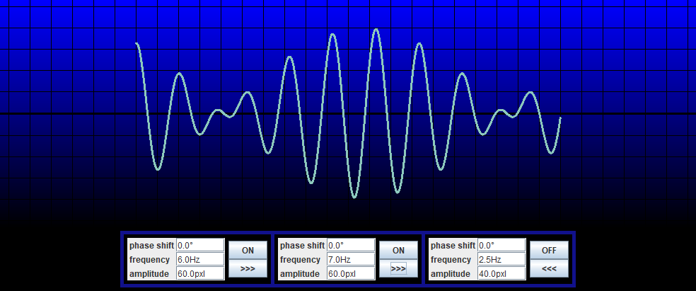

# WaveSimulator
grade 11 project - Wave simulator. A simple java GUI program that displays superimposed 2D waves on a rope. You can create cool patterns by changing parameters of wave source such as frequency, amplitude and shift. If you want to try out the program and have java installed on your computer, you can download WaveSimulator.jar and run it.

video: https://www.youtube.com/watch?v=X0a1YX845E4

